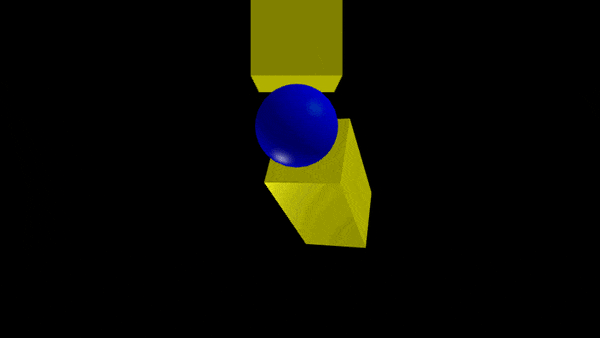
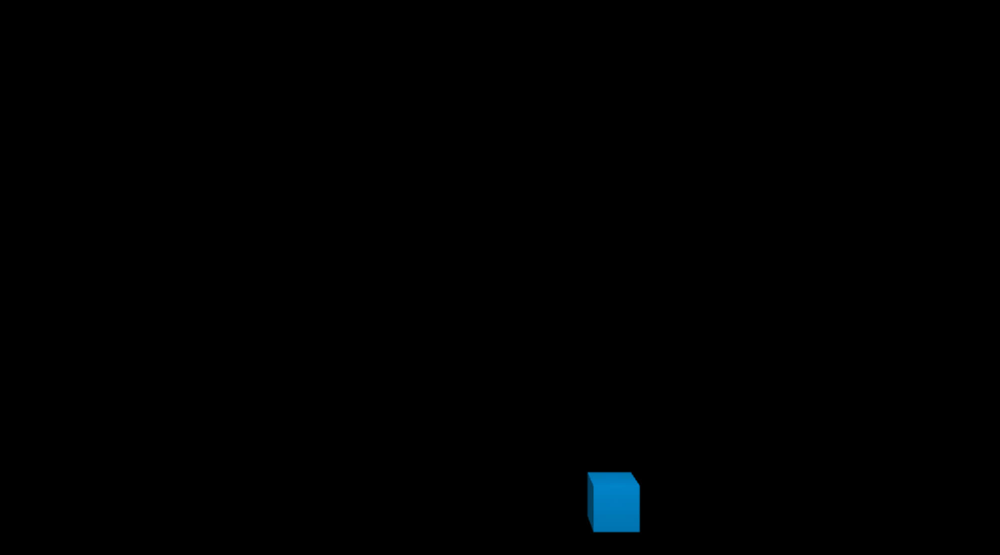
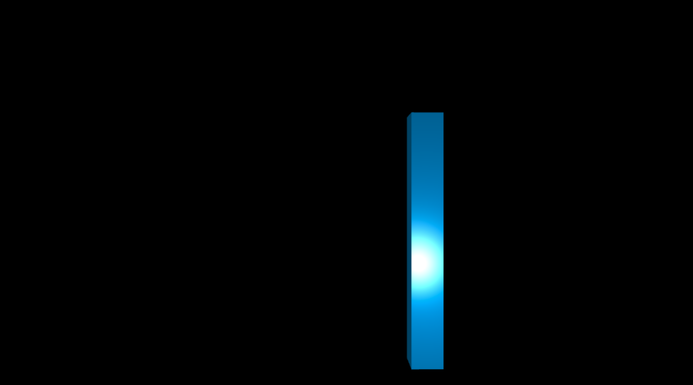
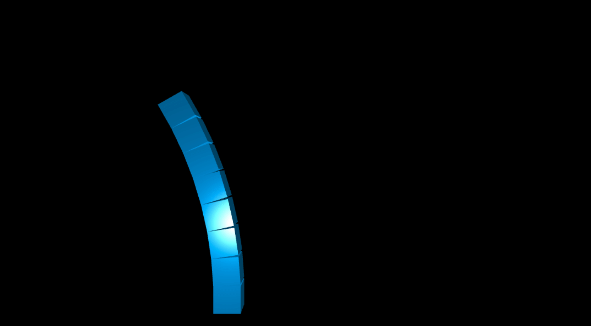
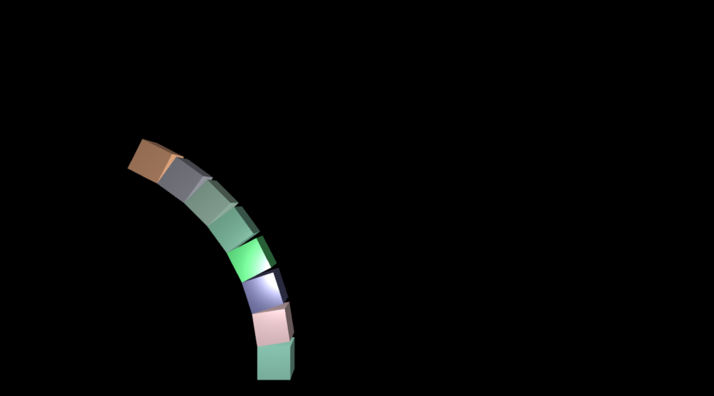
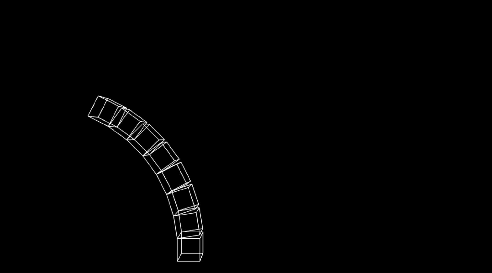
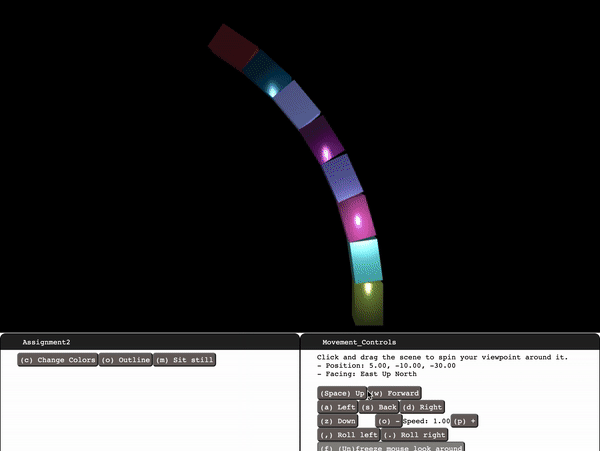

[](https://classroom.github.com/online_ide?assignment_repo_id=5895876&assignment_repo_type=AssignmentRepo)
# Assignment #2

### Basic Info:

* This assignment is **graded**, and it worth 25 pts (out of 500 pts in total).
* The deadline is 10/17 11:59 PM.
    * If the Syllabus and/or class notification made by instructor or TAs indicates a different DDL, please refer to the latest information.

### Repository setup:

1. By now you have followed the link to create your assignment repository. The repository name should look like **CS174A-21F-A2-githubusername**. 

2. You should also be sure to share your GitHub username with us via this link if you have not already. 

   * You should also be sure to setup your local git environment and SSH keys to work with GitHub.

3. Once your repository is created you will have a copy of the assignment template in your GitHub repository. Now you can clone the repository onto your local computer using the following command. Be sure do execute this command from the directory you wish to locate your work.

4. You can now follow the remaining steps of the assignment. This [debugger instruction](https://docs.google.com/document/d/e/2PACX-1vSi14Mb-_6qLN7wVA4-4NxqYR-3qHLy7ndjB2G0Ba6TCYHn_KGmrPbu-fCDtHkv9QcGBNqLUUdT6fu1/pub) can be helpful when your code does not work. 

### Getting Started:

Open the demo exactly as you did in Assignment 1: Run a dummy web server, navigate to the URL `localhost:8000`, observe the initial animation we provide, open Chrome developer tools, and perform the steps to map your local file folder as a Chrome workspace. 

At that point you'll be safe to edit your files without your edits disappearing or changing the wrong files. Then, proceed as follows.

### Preliminary Steps - Using the Code Library

In order to use our library, `tiny-graphics.js`, you the programmer must provide additional code: Three custom JavaScript classes. Each of the three will be a subclass of a different base class from tiny-graphics.js: `Shape`, `Shader`, and `Scene`. A `Shape` defines a 3D shape to draw, a `Shader` defines some code for coloring in triangles (perhaps as though they were illuminated by light sources), and a `Scene` class tells the 3D canvas and web page what you want to happen (usually, drawing a scene by placing shapes). The three subclasses must define certain methods correctly for the library to work, or nothing will get drawn.

In order to get you started, we have provided examples of those custom subclasses in your code, and you only have to tweak them to do this assignment. One of the Shapes we give, `Cube`, is complete, while the other, `Cube_Outline` is left empty for you to fill in.

The example scene we provided in `example/transform_sandbox.js` is a fully defined working example for you. The class, called `Transforms_Sandbox`, draws the extremely simple scene of boxes and balls you see when you initially run your Assignment files. It has the bare minimum to start using graphics to build a your first scene. Start your coding work there.

### Experimenting with Transforms_Sandbox

Inside the `display()` method of class `Transforms_Sandbox`, you will see some lines of code that call "`draw()`" on a particular shape, causing one of that shape to appear in the scene. You will also see other lines of code that modify a `model_transform` variable that contains a 4 by 4 matrix. These lines of code perform translations, rotations and scales -- the main math operations you need to understand to get started with graphics. To call them, pass in a 3x1 vector (a `Vec`, or a regular JavaScript array of three floats). In the case of `rotation()`, a scalar (representing the angle in radians) must be also provided along with the `Vec` (representing the axis of rotation).

Read the code comments above the `Vec` and `Mat` classes in `tiny-graphics.js` to see how they work.

Note I: `vec3` and `vec4` can generate new `Vetors` of dimension 3 and 4.

Note II: JavaScript has no operator overloading, so operations like `+, -, *, +=, *=,` etc. will not compile if you try to use them on the vector and matrix types (`Vec` and `Mat`). Instead use `times()` as shown in the `Transforms_Sandbox` class definition, and assign its return value back into your matrix to incrementally modify it. These can be chained together like so:

```javascript
M = M.times( T ).times( R ).times( S );
this.shapes.box.draw(context, program_state, M, this.materials.plastic.override(yellow));
```



Play with the code in `example/transforms_sandbox.js` and re-run your program until you are comfortable with the effects of changing numbers passed in to the transforms. Move around the calls to `draw()` to place new shapes. Put your operations into loops to draw lots of shapes and test your understanding of JavaScript.

Once you are comfortable with this, begin implementing the graded requirements below (a stack of cubes). 

__Your final scene must go in the `assignment2.js` in order to be graded.__

That class exposes its constructor to you, where you can see how it sets up the camera, lighting shader, and materials (which contain quantities related to how shapes and lights will interact), which are all defined there to help you do the actual assignment requirements.

In order to select the scene `Assignment2` to display instead of `Transforms_Sandbox`, once you are ready to switch you must change your `main-scene.js, line:28` . Simply replace where the `Transforms_Sandbox` name with `Assignment2`. It will draw that instead.

We have marked places in the code with "**// TODO**" to demark anywhere we intend for your final code to be in order to get points. All of these places you modify are inside the file `assignment2.js`.

### Graded Steps

#### Up to 25 points of credit. There is no partial credit for any individual requirement.

Implement the assignment in clean and understandable code. Each required part must successfully draw and show up onscreen in order to count.

NOTE: Please use the default camera definition defined in the `assignment2.js`.

**If any parts are unclear, ask on Piazza.**

#### Point distribution:

1. Modify our template, which displays WebGL in an HTML canvas, without introducing errors – **2 points.**

    
    
> Hint: Before you begin to make changes, you should see a single blue cube as above.
> 

2. Display a stack of eight (8) unit cubes starting from the origin and extending upward – **5 points.**

   Instance each of the eight cubes from the same geometry data (we defined this as "box" in your scene's constructor function). Due to our other provided code in the constructor, the boxes will appear with a symmetric perspective projection, with square aspect ratio (not stretched or squeezed). The initial camera position at the given position (-5, 10, 30) is far back enough to view the scene. Note that to place a camera there is the opposite transform action that would be used to place a regular shape.


> Hint: After this step, you should see a stack of 8 blue (shiny) cubes as above.

3. Make the stack of boxes sway like a blade of grass in the wind. It should sway back and forth **once per two seconds**. Be exact if you can. 

   (a). Without passing through one another, the boxes must rotate over time to a maximum angle of `.05*Math.PI`. Place the hinge of each box's rotation motion exactly at the top left edge of the box underneath it. Each box touches the previous in exactly the same way and remains in constant contact, precisely connected only by the correct edge. The boxes may not separate from each other along this edge; **no floating geometry** is allowed – **4 points.**

   > Hint: Remember that you can chain more than just one translation and rotation together when adjusting your transformation between drawing shapes. 

   (b). Fluidity of your rotation motion matters. Functions of the form `f(t) = a + b*sin(w*t)` are useful for modeling periodic motion, where "`a`" is large enough that the rotation angle does not go negative and cause boxes to collide. Use `program_state.animation_time` for `t`, which is how long the program's been running in milliseconds – **2 points.**

   (c). Iteratively place the rest of the moving box segments on top of one another to complete the swaying motion. Use a hierarchical approach - each box's transform is the "child" of the previous transform, derived from its matrix value – **1 points.**

   > Hint: To make structures that have a parent-child hierarchy like this, you must incrementally create your transform using `times()` to **post-multiply** each new term onto the right side of your matrix variable. Do this to incrementally change it from the value that drew the previous (parent) box. Never do a pre-multiply for this assignment; for certain reasons that's not as useful for designing structures that you think of as a hierarchy of shapes.

   You should learn to organize your code into functions, instead of describing your whole scene in `display()`. For part (c) we recommend moving your code for drawing one box into the blank `draw_box()` method, and then calling it many times from `display()` using a for loop. Changing the function signature (arguments) to `draw_box()` is allowed, since it may be necessary to know which box (numbered from bottom to top) you're drawing for color purposes.

   (d). Fill in code inside your class method `make_control_panel()` to implement a button to help us with grading. To do this, call `key_triggered_button()` as already shown inside the method, and make sure the second argument is [ "m" ] so that we can press the m key to test your button. Fill in the third argument, the function that gets executed each button press, so as to make it toggle the swaying motion on and off. When the swaying is turned off, your blade of grass must be extended out to the **maximum possible angle** of `.05*Math.PI` so that we can see the gaps between your boxes along the left side – **1 points.**


> Hint: After implementing the sway back and forth, it should looks like the above. (This is a GIF from older version of this assignment, the replaying speed might differ on different devices, and the required speed should be "sway back and forth **once per two seconds**". In this GIF, we let the cube stack swaying and then pressed `M` to set it still to the maximum angle)

4. 
   (a). Color each box differently (and randomly) from the one underneath, for contrast. So that colors **stay the same from one frame to the next**, base your colors on persistent variables you store in your class, which means you'll use the `this` keyword to declare them – **3 points.**
   
   > Hint: One possible way to generate random color is `color(Math.random(), Math.random(), Math.random(), 1.0)`. Or you can change the range of the random numbers to ensure the color will not be too dark.

   (b). Fill in the `set_colors()` function to somehow cause your class's colors to reset to different values. Once you do this, pressing the 'c' key (which already calls `set_colors`) should set the colors of the boxes to a **new set of random colors** – **1 points.**



5. Draw each cube’s outline (the edges) in white. For this, you will need to design a new `Shape` subclass. Fill in the empty parts we left in the `Cube_Outline` class, defined in your `assignment2.js` file. It will be like your `Cube`'s definition above it, except with your own brand new arrays. Each vertex gets a position and a color (`color` replaces `normal` in this example). Define the positions of your cube outline as x,y,z coordinates of the cube points. Order them in pairs, so that each pair is one edge of the outline. You may NOT have any extra edges going across diagonals. Set each color value in the `color` array to full white - making sure the list has as many entries as the `positions` list. Do not make an indices list - instead use "`this.indices = false`".

   (a). To actually draw your outline, you will need to call `draw()` on it and pass in a material that is compatible with it. That's because you just changed its available `Shape` fields to "positions" and "color", and so the type of `Shader` we use on it has to know what to do with that information. The variable we called "`this.white`" already holds such a proper, compatible material -- so just pass that one in as your third parameter to `draw()` your outline. This should draw it using exactly the colors you made for it (white colors). Lastly, to actually draw lines instead of triangles (letting it know that there's __pairs__ of vertices instead of triples), you must pass in the string "LINES" as the last argument to `draw()` – **3 points.**

   (b). Rather than drawing your outline at all times, fill in code inside your class method `make_control_panel()` to implement another button. Call `key_triggered_button()` as shown, and make sure the second argument is [ "o" ] so that we can press the o key to test your button. Fill in the third argument, the function that gets executed each button press, so as to toggle a flag that you'll use to turn the outline on and off. When the outline is off, draw the boxes normally (colors, lighting, etc.). When the outline is on, draw the outline instead on all boxes (it's OK to skip doing this for the bottom-most box since it's special, as explained below) – **1 points.**



6. Triangle strips are a common graphics primitive. Implement the **odd number** (count from bottom to top, starting with index 1, i.e., draw the **1st, 3rd, 5th, 7th** box differently) box's geometry as a single triangle strip primitive. This is like making a cube that can unfold into a single line of triangles.

   Create a new `Shape` subclass with whatever correct entries in the `position` and `indices` lists that will make that happen. Give each vertex a `normal` that is simply **equal to the position**. When calling `draw()` to make this box, pass in the string `"TRIANGLE_STRIP"` for the fifth argument so that the graphics card uses triangle strip indexing. This box should appear **lit up differently** than the others, especially near edges as you move the camera around it, because of its unusual layout – **1 points.**

7. Scale your boxes so that instead of being unit cubes, they are stretched to 1.5x their length only along the Y axis. Adjust your translations accordingly so that the correct hinge contact points are maintained throughout the swaying motion. Again, no floating geometry is allowed. Neither are any shearing effects that deform the boxes to non-right angles during motion. Prepare your left-to-right chain of transformations accordingly for each separate shape so that those things cannot happen – **1 points.**

> Hint: Requirement 6 and 7 used to be extra credit so it might be a little challenging.

The final reference GIF with mouse interaction:


### Submitting Assignment 2 on GitHub:

1. Once you are finished working it is time to 'commit' your work to your remote repository on GitHub. You will also want to do this periodically while you are working to make a backup of your work and to make your final submission. We will keep the process very simple by just 'committing' the master branch of your local repository into the remote repository on GitHub.

2. The first step is to add any new files into the repository so they can be tracked.

    ```bash
    $ git add *
    ```

3. Then we commit any new and or changed files to the repository. The text after the -m is for you to describe what is included in this commit to the repository.

    ```bash
    $ git commit -m "Description of what I did"
    ```

4. Finally, we need to push these changes up to our remote repository on GitHub. This is a very important step! Without it you are not copying your work back to GitHub and we will not be able to see it if you forget.

    ```bash
    $ git push
    ```

5. You can repeat these commands as often as you feel the need as your work on your assignment. However, again, you must always make a final push to GitHub when you are finished in order to submit your work. We will make a clone of all of the assignment repositories at the deadline. That implies two things. First, make your final push to GitHub ahead of time and second, any pushes you make after the deadline will not be seen by us.
