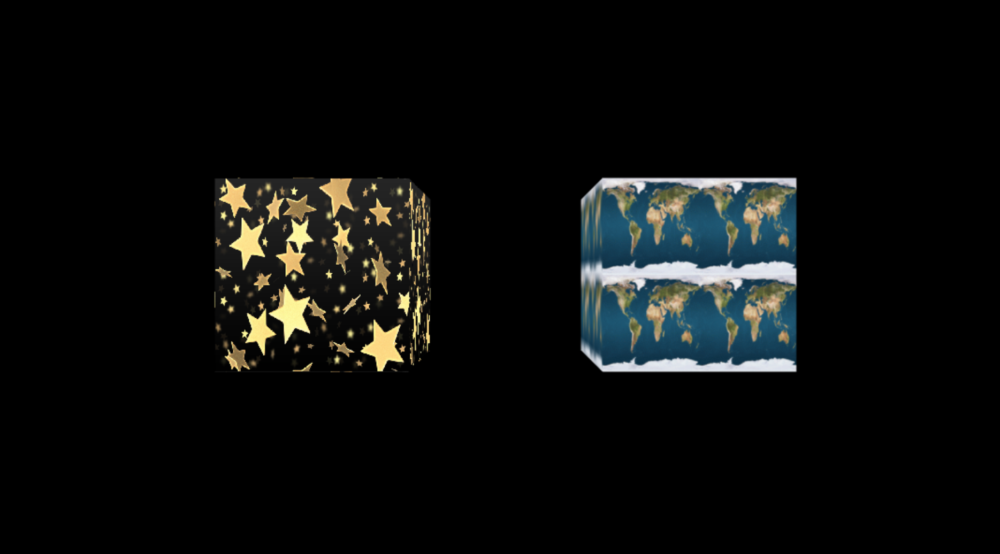
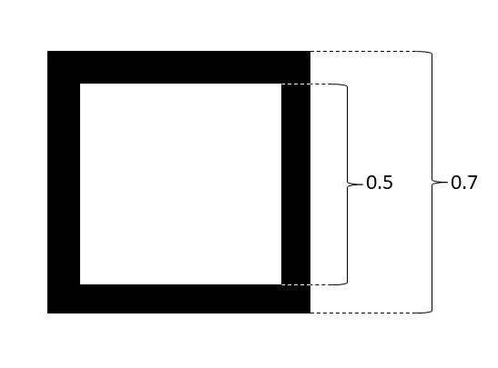
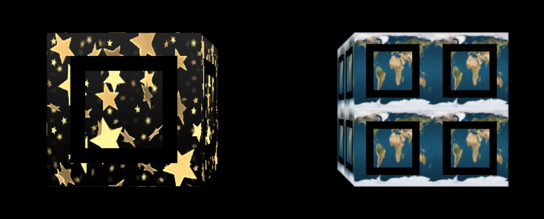

# Assignment #4

## Due: Nov 17, 2021 at 11:59pm

### Repository setup:

1. By now you have followed the link to create your assignment repository. The repository name should look like **CS174A-21F-A4-[Github-ID]**. 

2. You should also be sure to share your GitHub username with us. 

   * You should also be sure to setup your local git environment and ssh keys to work with GitHub.

3. Once your repository is created you will have a copy of the assignment template in your GitHub repository. Now you can clone the repository onto your local computer using the following command. Be sure do execute this command from the directory you wish to locate your work.

4. You can now follow the remaining steps of the assignment. This [debugger instruction](https://docs.google.com/document/d/e/2PACX-1vSi14Mb-_6qLN7wVA4-4NxqYR-3qHLy7ndjB2G0Ba6TCYHn_KGmrPbu-fCDtHkv9QcGBNqLUUdT6fu1/pub) can be helpful when your code does not work. 


### Graded Steps

#### Up to 25 points of credit. There is no partial credit on any individual requirement. Late assignments are penalized 25% per day (no exceptions).

Implement the assignment in clean and understandable code. Each required part must successfully draw and show up onscreen in order to count. If you use code that you found online you must cite it inside your program file otherwise that is plagiarism.

**If any parts are unclear, ask on Piazza.**

#### Point distribution

1. Implement functionality to load two different square images of your choice into texture maps. You must include whatever files are needed for us to run your code in the "assets" folder of your repository (images, etc.) **- 2 points**

   **Remember**, not just any image that you download will work.  Images used for texture maps in WebGL 1.0 must be square and have power of two dimensions (therefore only square images of a few limited sizes like 128x128 and 256x256 are valid).  WebGL 2.0 doesn't have this limitation but it also isn't widely supported on phones yet so we don't use it.

   To load a texture into a `Material`, assign a new value to the `Material` object called `"texture"`.  To assign `"texture"` with the right value, use one of our functions that returns a reference to an image file.  Load your image using the class `Texture`, found in `tiny-graphics.js`.  You can read the class `Texture` to see what this class does.

   A `Texture`'s color is scaled by the Phong formula's ambient weight.  Make your image match its original colors this time, by setting the ambient `color` to opaque black and adjusting the `ambient`.  (FYI, images with transparent pixels are accounted for in the formula too -- the shape's base color affects the texture's color additively, but the transparencies combine multiplicatively).

   > Hint: You can use the images under the `assets` folder, like following files:
   >
   > * `assets/stars.png`: 512x512 
   > * `assets/earth.gif`: 128x128

2. Apply the entire first texture image onto each face of a cube (cube #1) that has dimensions 2x2x2. The texture coordinates should range from (0,1) in both the `s` and `t` dimensions. Filtering should be set to use **nearest neighbor** (set the second parameter for Texture constructor as `"NEAREST"`). **– 3 points**

3. Create a second cube (cube #2) with dimension 2x2x2 where the second texture image is applied to each face but is zoomed out by 50% (the image should shrink; the whole image will appear four times, once in each corner). Enable Mip Mapping for the zoomed texture using **tri-linear filtering** (set the second parameter for Texture constructor as `"LINEAR_MIPMAP_LINEAR"`) **- 2 points**

4. Position both cubes side by side within the view of your starting camera view:  Place the camera **8 units back** from the origin. Both cubes should have a dimension of 2x2x2. Place the center of cube #1 at (-2,0,0) and the center of cube #2 at (2,0,0). Use a perspective projection.  As you move the camera nearer or farther away, along the z-axis, from the cubes we should see the effect of the texture filtering as the textures get smaller or larger.  For the cube that uses poor sampling, the image should show grainy, flashing static noise at the pixel level **- 2 points**



> Hint: if you set up the scene and texture correctly, the position of the cubes should look like the above (Of course you might choose different texture images). Note that different texture filtering method will cause difference when texture is "compressed" due to our viewing angle, like following:
> 

5. Use the key ‘c’ (with our usual web buttons) to start and stop the rotation both cubes. The cube #1 should rotate around its own X-axis at a rate of 20 rpm. Cube #2 should rotate around its own Y-axis at a rate of 30 rpm. The cubes **should not jump to a different angle when they start and stop** **- 4 points**


6. Use continuous scrolling the texture map on cube #2. Translate the texture varying the s texture coordinate by 2 texture units per second, causing it to slide along the box faces.  Reset the texture coordinates passed into the GLSL's `texture2D` call periodically so they do not continue to grow forever, which could cause the interpolated values to lose needed decimal precision **- 4 points**

   To code this part, fill in class `Texture_Scroll_X` which will be a modification of `Textured_Phong` shader, overwriting its `fragment_glsl_code` function to give it new fragment shader code.  Use that shader instead of `Textured_Phong` for cube #2.  

   > Note 1: In the fragment shader, the varying "`f_tex_coord`" stores the vec2 of pre-interpolated texture coordinates.

   > Note 2: The variable `animation_time` is already passed all the way through into the fragment shader for you.

   > Warning:  When coding in GLSL, integer literals like "2" cannot be used most of the time.  Use floats instead by ending your number in a decimal.  Also, you'll have to describe PI for it since there is no built-in constant.  You can make a 4x4 matrix of any form using the `mat4()` constructor, where the matrix is in *column-major* order (the first four entries are the first column, etc).

7. Rotate the texture map itself on all faces of cube #1 around the center of each face at a rate of 15 rpm.  As with #6, prevent the rotation angle from growing excessively as `animation_time` grows **- 4 points**

   To code this part, fill in class `Texture_Rotate` which will be a modification of `Textured_Phong`, overwriting its `fragment_glsl_code` function to give it new fragment shader code.  Use that shader instead of `Textured_Phong` for cube #1.

   

8. Now add the outline of a black square in the center of each texture that moves with the texture. This should be done by just modifying the fragment shader. **- 4 points**

   The dimensions of the black square in the texture coordinate space are shown below:

   

   > Note 1: Recall that one of the cubes has 4 instances of the texture on one face. This cube requires 4 black square outlines in the center of each texture instance.

   Below is what the square outlines should look like if the textures aren't moving:

   

   And below is what the square outlines should look like if the textures are moving:

   


### Submitting Assignment 4 on GitHub:

1. Once you are finished working it is time to 'commit' your work to your remote repository on GitHub. You will also want to do this periodically while you are working to make a backup of your work and to make your final submission. We will keep the process very simple by just 'committing' the master branch of your local repository into the remote repository on GitHub.

2. The first step is to add any new files into the repository so they can be tracked.

    ```bash
      $ git add *
    ```

3. Then we commit any new and or changed files to the repository. The text after the -m is for you to describe what is included in this commit to the repository.

    ```bash
      $ git commit -m "Description of what I did"
    ```

4. Finally, we need to push these changes up to our remote repository on GitHub. This is a very important step! Without it you are not copying your work back to GitHub and we will not be able to see it if you forget.

    ```bash
      $ git push
    ```

5. You can repeat these commands as often as you feel the need as your work on your assignment. However, again, you must always make a final push to GitHub when you are finished in order to submit your work. We will make a clone of all of the assignment repositories at the deadline. That implies two things. First, make your final push to GitHub ahead of time and second, any pushes you make after the deadline will not be seen by us.
